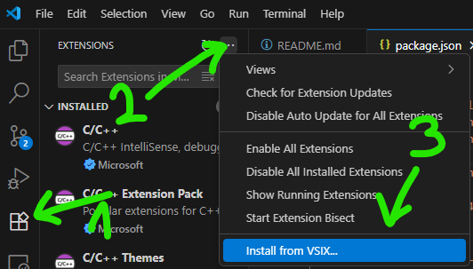

# Cline Local – Lean, local‑only fork of Cline

Cline Local is a lean, local‑only fork of the Cline VSCode extension. It preserves the Plan/Act toolchain, MCP support, and file/terminal integration while permanently removing browser automation, telemetry/analytics, authentication/billing, cloud‑only model providers, and background checkpoints. This variant is designed for teams who manage Git directly and for environments with strict data protection policies where cloud APIs are restricted or disallowed.

---

## Latest Release

- v0.2.1: [Release notes](https://github.com/nobody-qwert/cline-local/releases/tag/v0.2.1) • [Download VSIX](https://github.com/nobody-qwert/cline-local/releases/download/v0.2.1/cline-local-0.2.1.vsix)

## Compatibility (v0.1.0)

- Tested backend: LM Studio only
- Known‑good models:
  - GPT‑OSS family: `gpt-oss*`, `openai/gpt-oss` (reasoning supported)
  - Qwen 30B A3B variants: `qwen3-30b-a3b-thinking-2507`, `qwen3-30b-a3b`, `qwen3-30b-a3b-instruct-2507`, `qwen3-coder-30b-a3b-instruct` (incl. MLX port)
- Others may work via OpenAI‑compatible endpoints or Ollama, but are untested in this release.

## Core capabilities

- Plan/Act workflow with human‑in‑the‑loop approvals (diff review for file edits; approval before terminal commands)
- Focus Chain: automatic task breakdown with step‑by‑step completion progress
- Create and edit files with diffs; adapts to linter/compiler output to self‑correct common issues
- Terminal integration: execute commands with approval and stream output; long‑running processes can continue while tasks proceed
- MCP integration: connect to servers for custom tools/resources
- Read‑only web ingestion via `web_fetch` (HTTP→Markdown; no browser automation)
- Local providers: OpenAI‑compatible (configurable `baseUrl`), Ollama, LM Studio
- Git‑friendly by design: no background checkpoints; works cleanly with your Git workflows

---

## Key differences from upstream

- Removed
  - Browser automation (`browser_action`, computer‑use features)
  - Cloud provider integrations (Anthropic, OpenRouter, Gemini, Bedrock, Mistral, etc.)
  - Telemetry/analytics and account/billing UIs
  - Background checkpoints (no internal Git snapshots)
- Retained and focused
  - Plan/Act workflow with approvals
  - MCP integration (custom tools/resources)
  - Local‑only providers: OpenAI‑compatible (configurable `baseUrl`), Ollama, LM Studio
  - Git‑friendly operation (works cleanly with your own Git practices)

---

## Privacy, security, and operations

- No telemetry, account, or billing flows
- Strictly controlled network access (only your provider endpoint and `web_fetch` when used)
- Human‑in‑the‑loop approvals for file edits and terminal commands
- Smaller dependency footprint; fewer moving parts
- Works cleanly with Git; no internal snapshots

---

## What Cline Local Can Do

See Core capabilities above.

## Install (VSIX)

- Download the VSIX from the latest release
- VSCode → Extensions → ••• → Install from VSIX…
- Select the file, then Reload

---

## Quick Start (Build from Source)

### Prerequisites
- VSCode v1.84+
- Node.js 18+ (Node 20.x used in development)
- Git

### Install
- Clone this repo
- Install dependencies:
  - `npm run install:all`

### Build
- Build the extension + webview:
  - `npm run package`
- Or for development:
  - `npm run watch` (and separately, `npm run dev:webview` if you prefer hot webview dev)

### Run in VSCode
- Open this folder in VSCode
- Press `F5` (Run Extension) to launch an Extension Development Host

### Optional – Create a VSIX
- `npx vsce package`
- In VSCode: Extensions panel → "Install from VSIX…"

---

## Configure providers

Supported local providers: OpenAI‑compatible (configurable `baseUrl`), Ollama, LM Studio.

Open the extension UI → Settings, then select one of:

- Ollama
  - Ensure Ollama is running locally (default `http://localhost:11434`)
- LM Studio
  - Ensure the server is running and set the `baseUrl` accordingly

Choose models available from your selected provider.

---

## Using `web_fetch` (Read‑only Web Ingestion)

- Mention `@url` in chat or allow Cline Local to call the `web_fetch` tool when needed.
- The fetcher:
  - Upgrades `http://` to `https://` when possible
  - Uses axios for HTTP and cheerio to strip `script/style/nav/header/footer`
  - Converts cleaned HTML to Markdown with turndown
- No browser session is created; this is content ingestion only.

---

## Tool Suite (Local)

- `execute_command`
- `read_file`, `write_to_file`, `replace_in_file`
- `list_files`, `list_code_definition_names`, `search_files`
- `ask_followup_question` (for clarifications)
- `attempt_completion` (final result/summary)
- `new_task` (create tasks with context)
- `use_mcp_tool`, `access_mcp_resource` (MCP integration)
- `web_fetch` (HTTP‑only)

---

## Repository Policy

- Upstream: https://github.com/cline/cline
- Originally derived from cline/cline (Apache 2.0). The GitHub fork relationship has been detached due to divergence; an upstream remote is kept for reference.
- PRs disabled: This fork does not accept public pull requests
- Manual upstream sync:
  - Changes are cherry‑picked or merged manually from upstream as needed
  - Feature selection aims to preserve local‑only behavior and a small footprint

---

## Versioning and CHANGELOG

Cline Local currently uses pre-1.0 semantic versioning (v0.1.x). Until v1.0.0, minor version bumps may include breaking changes. After v1.0.0, we will follow standard semantic versioning:
- MAJOR: Breaking changes or significant architectural updates
- MINOR: New features, upstream merges with compatible changes
- PATCH: Bug fixes, security updates, minor improvements

### Upstream Integration Policy

When merging relevant changes from upstream Cline:
- Only privacy-compatible features are integrated
- Cloud/telemetry features are explicitly excluded
- Changes are documented as "merged upstream improvements" with version references
- Fork-specific modifications are clearly distinguished from upstream contributions

### Changelog Structure

- `CHANGELOG.md` records changes specific to Cline Local (since v0.1.0)
- Relevant upstream changes are referenced in our release notes when applicable
- Expect version skew vs upstream due to selective syncing and the removal of cloud/browser features

---

## Contributing

- Public contributions are not accepted on this fork
- For new features or broader ecosystem participation, contribute to upstream `cline/cline`
- For local‑only customizations, consider forking this repo

---

## License and Credits

- Licensed under Apache 2.0 (same as upstream). See `LICENSE`
- Derived from the Cline project by Cline Bot Inc.
- Not affiliated with or endorsed by Cline Bot Inc. “Cline” is a trademark of its respective owner.
- Disclaimer: This software is provided “AS IS”, without warranty of any kind. The authors and contributors are not liable for any damages or misuse. See the LICENSE for details.
- All trademarks and brand names belong to their respective owners

---

## Troubleshooting

- Build: `npm run check-types`, `npm run lint`, `npm test`
- Terminal integration: see `docs/troubleshooting/terminal-quick-fixes.mdx`
- If a feature references a removed provider or browser automation, it's not supported in this fork by design
